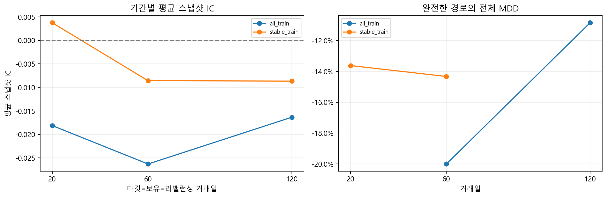
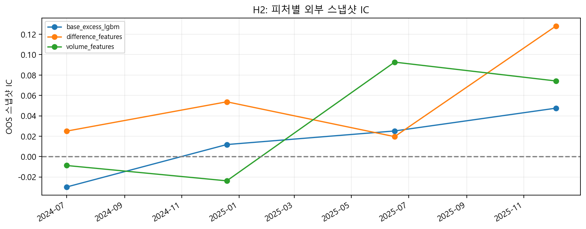
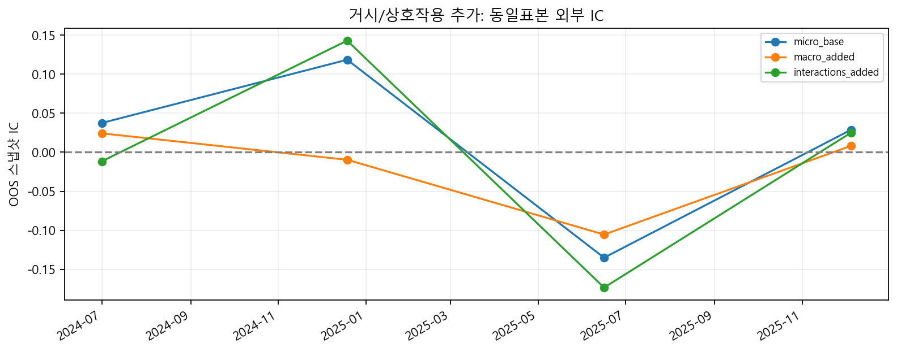
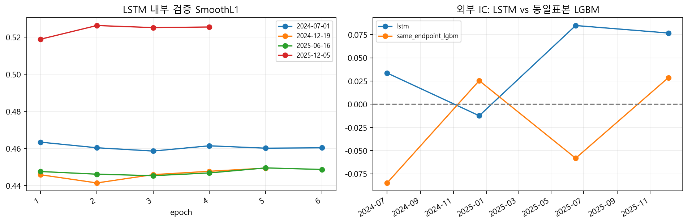
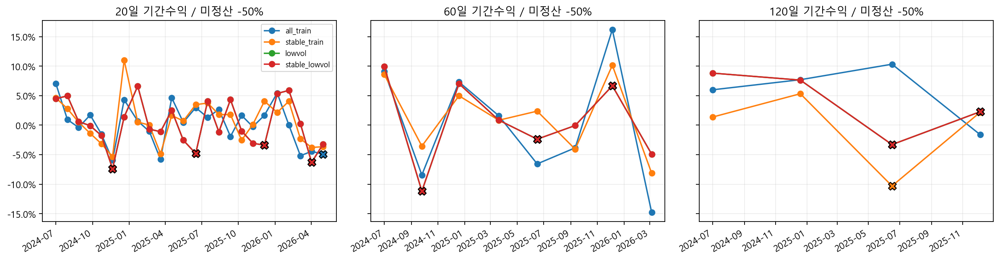
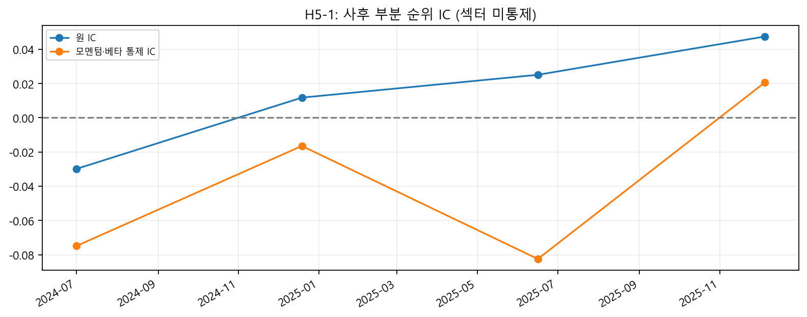
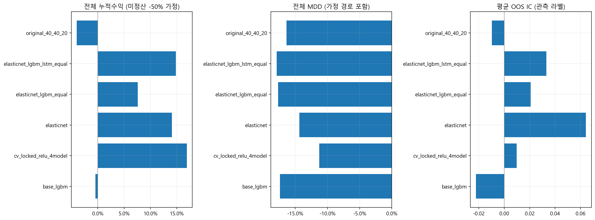
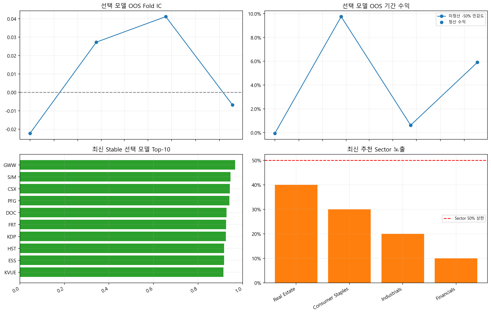

# S&P 500 안정군·수익성 통합 가설 검증 보고서

이 보고서는 `sp500_stability_v14.ipynb`와 `test_validation_report.ipynb`의 가설을 하나의 데이터 계약과 하나의 Stable 정의로 재배치한 제출용 실행 결과다.

## H0. 공통 분석 파이프라인

- 프로젝트 루트: `C:\workspaces\middle\final`
- 입력: `data/processed/final_df.parquet`, 시장 가격지수, 편입이력, 정적 Sector, 고정 거시시장 사본
- 통일 Stable: 날짜별 K=3, `vol_ann_120d` + `|beta_120d|`, 축별 표준화 후 가장 낮은 중심 군집
- 미래 위험과 수익은 모두 신호일 다음 거래일 진입을 기준으로 계산한다.
- 미래 위험값은 Stable 생성이나 수익 추천 입력으로 전달하지 않는다.

### 데이터 커버리지

| year | mean_price_coverage | min_price_coverage | mean_missing_securities |
| --- | --- | --- | --- |
| 2016 | 0.9309 | 0.9147 | 34.9405 |
| 2017 | 0.9491 | 0.9387 | 25.7410 |
| 2018 | 0.9583 | 0.9564 | 21.0916 |
| 2019 | 0.9650 | 0.9584 | 17.6667 |
| 2020 | 0.9734 | 0.9683 | 13.4545 |
| 2021 | 0.9804 | 0.9743 | 9.9048 |
| 2022 | 0.9853 | 0.9822 | 7.4223 |
| 2023 | 0.9890 | 0.9861 | 5.5480 |
| 2024 | 0.9927 | 0.9901 | 3.6944 |
| 2025 | 0.9940 | 0.9920 | 3.0200 |
| 2026 | 0.9962 | 0.9940 | 1.8943 |

## S-H1. 현재 Stable은 미래 위험을 구분하는가?

K 후보의 내부 군집지표를 확인한 뒤 고정 K=3 정책을 미래 120거래일 변동성·MDD·상위 30% 위험 여부로 검증한다.

| k | silhouette | dbi | min_cluster_share |
| --- | --- | --- | --- |
| 2 | 0.4921 | 0.8098 | 0.3115 |
| 3 | 0.4345 | 0.7943 | 0.1239 |
| 4 | 0.4069 | 0.8152 | 0.0637 |
| 5 | 0.3970 | 0.7976 | 0.0368 |
| 6 | 0.3974 | 0.7875 | 0.0236 |

| stability_group | rows | dates | mean_future_vol | mean_future_mdd | mdd_breach | future_risky_rate |
| --- | --- | --- | --- | --- | --- | --- |
| Middle | 4218 | 20 | 0.3185 | -0.1944 | 0.5989 | 0.3310 |
| Risky | 1218 | 20 | 0.4734 | -0.2810 | 0.8276 | 0.7997 |
| Stable | 4281 | 20 | 0.2455 | -0.1542 | 0.4205 | 0.1282 |

**해석:** Stable의 미래 고위험 비율이 다른 군집 평균보다 낮아 위험 구분 방향은 관찰됐다. 인과효과나 일반화 성능으로 해석하지 않는다.

## S-H2. Volatility와 |Beta| 두 축은 단일 축보다 유용한가?

동일 날짜·동일 후보 수에서 Volatility-only, Beta-only, 통일 2축 KMeans의 False-Stable과 미래 MDD를 비교한다.

| policy | selected | false_stable_rate | mean_future_mdd |
| --- | --- | --- | --- |
| beta_only | 214.0500 | 0.1551 | -0.1606 |
| canonical_2d_kmeans | 214.0500 | 0.1198 | -0.1547 |
| volatility_only | 214.0500 | 0.0853 | -0.1508 |

**해석:** 상관이나 군집 내부지표만으로 Beta의 추가가치를 선언하지 않고, 미래 위험 결과와 후보 유지 조건을 함께 판단한다.

## S-H3. 긴 위험 Lookback이 False-Stable을 줄이는가?

위험 Lookback 20/30/60/120/252를 같은 미래 120일 outcome으로 비교한다. 이는 수익 보유기간 비교와 별개의 실험이다.

| lookback | rows | dates | stable_n | false_stable_rate | mean_future_mdd |
| --- | --- | --- | --- | --- | --- |
| 20 | 9742 | 20 | 5436 | 0.1858 | -0.1618 |
| 30 | 9739 | 20 | 4951 | 0.1642 | -0.1608 |
| 60 | 9728 | 20 | 4672 | 0.1359 | -0.1547 |
| 120 | 9717 | 20 | 4281 | 0.1282 | -0.1542 |
| 252 | 8762 | 18 | 3477 | 0.1076 | -0.1556 |

**해석:** 120일은 통계적 최적값이 아니라 원본 정책과 수익성 handoff를 연결하기 위한 사전 고정 절충안이다.

## S-H4. 산업 내 상대안정성 보강은 False-Stable을 줄이는가?

| policy | selected | dates | retention | false_stable_rate | mdd_breach | mean_future_mdd |
| --- | --- | --- | --- | --- | --- | --- |
| market_stable | 4281 | 20 | 1.0000 | 0.1282 | 0.4205 | -0.1542 |
| balanced_verified | 3317 | 20 | 0.7748 | 0.1152 | 0.4001 | -0.1509 |
| balanced_eligible | 3317 | 20 | 0.7748 | 0.1152 | 0.4001 | -0.1509 |

| estimate | ci_low | ci_high | dates |
| --- | --- | --- | --- |
| -0.0126 | -0.0194 | -0.0063 | 20 |

**해석:** Balanced Verified의 False-Stable 비율은 Market Stable 대비 -1.31%p 감소했다. 후보 유지율과 날짜 블록 CI를 함께 봐야 한다.

## S-H5. Sector별 미래위험 모델은 Global 모델보다 나은가?

현재 위험 두 축으로 미래 위험 상위 30%를 분류하고 연속형 위험점수를 회귀한다. Global 모델은 2024 Validation에서 사전 규칙으로 고른 뒤 2025 Test에 적용하며, Sector refit은 같은 구조를 사용한다.

| split | model | recall | f1 | pr_auc | roc_auc |
| --- | --- | --- | --- | --- | --- |
| validation | Logistic | 0.2416 | 0.3702 | 0.6412 | 0.7766 |
| validation | RandomForest | 0.3188 | 0.4398 | 0.6593 | 0.8040 |
| validation | HistGradientBoosting | 0.3423 | 0.4584 | 0.6478 | 0.7975 |
| test | HistGradientBoosting | 0.5302 | 0.5985 | 0.6895 | 0.8132 |

| split | model | mae | rmse | r2 |
| --- | --- | --- | --- | --- |
| validation | Ridge | 0.4731 | 0.7587 | 0.3272 |
| validation | RandomForest | 0.4607 | 0.7543 | 0.3350 |

| Sector | actual_risky_n | status | global_recall | sector_refit_recall | delta_recall | global_pr_auc | sector_pr_auc | discordant_pairs | paired_exact_p |
| --- | --- | --- | --- | --- | --- | --- | --- | --- | --- |
| Communication Services | 9 | EXPLORATORY | 0.3333 | 0.3333 | 0.0000 | 0.6611 | 0.5481 | 0 |  |
| Consumer Discretionary | 39 | EXPLORATORY | 0.5128 | 0.5385 | 0.0256 | 0.7213 | 0.7501 | 13 | 1.0000 |
| Consumer Staples | 12 | EXPLORATORY | 0.4167 | 0.0833 | -0.3333 | 0.5232 | 0.3378 | 4 | 0.1250 |
| Energy | 12 | EXPLORATORY | 0.2500 | 0.4167 | 0.1667 | 0.3946 | 0.2891 | 4 | 0.6250 |
| Financials | 26 | EXPLORATORY | 0.5385 | 0.1538 | -0.3846 | 0.5839 | 0.4716 | 10 | 0.0020 |
| Health Care | 39 | EXPLORATORY | 0.3590 | 0.2051 | -0.1538 | 0.5693 | 0.4770 | 14 | 0.1796 |
| Industrials | 32 | EXPLORATORY | 0.4062 | 0.1875 | -0.2188 | 0.4891 | 0.3901 | 11 | 0.0654 |
| Information Technology | 80 | CONFIRMATORY | 0.7250 | 0.6375 | -0.0875 | 0.8939 | 0.8632 | 11 | 0.0654 |
| Materials | 13 | EXPLORATORY | 0.5385 | 0.6154 | 0.0769 | 0.6785 | 0.7558 | 3 | 1.0000 |
| Real Estate | 4 | EXPLORATORY | 0.0000 | 0.0000 | 0.0000 | 0.1525 | 0.1270 | 0 |  |
| Unknown | 25 | EXPLORATORY | 0.5600 | 0.7200 | 0.1600 | 0.8409 | 0.8534 | 6 | 0.2188 |
| Utilities | 7 | EXPLORATORY | 1.0000 | 0.1429 | -0.8571 | 1.0000 | 0.5831 | 6 | 0.0312 |

**해석:** Classification의 Recall을 주지표로 사용하고 Regression은 동일 위험 outcome에서 파생된 보조 consistency check로만 본다. Confirmatory Sector가 2개 미만이면 Sector-wide 결론을 내리지 않는다.

## 안정성 → 수익성 Handoff

수익 모델에는 현재 시점의 Stable·산업 상태만 전달한다. `future_` 위험 outcome은 전달하지 않는다.

| Date | Ticker | Sector | risk_rank | stability_group | stable | industry_status | industry_unknown | balanced_verified | balanced_eligible | vol_ann_120d | beta_120d |
| --- | --- | --- | --- | --- | --- | --- | --- | --- | --- | --- | --- |
| 2016-06-24 00:00:00 | A | Health Care | 2 | Middle | False | MIDDLE | False | False | False | 0.2483 | 1.2570 |
| 2016-06-24 00:00:00 | AABA | Unknown | 2 | Middle | False | STABLE | False | False | False | 0.3390 | 1.3118 |
| 2016-06-24 00:00:00 | AAL | Unknown | 2 | Middle | False | MIDDLE | False | False | False | 0.3706 | 1.5059 |
| 2016-06-24 00:00:00 | AAP | Unknown | 1 | Stable | True | STABLE | False | True | True | 0.2470 | 0.7468 |
| 2016-06-24 00:00:00 | AAPL | Information Technology | 1 | Stable | True | STABLE | False | True | True | 0.2732 | 1.1276 |
| 2016-06-24 00:00:00 | ABBV | Health Care | 1 | Stable | True | MIDDLE | False | False | False | 0.3086 | 0.8273 |
| 2016-06-24 00:00:00 | ABT | Health Care | 1 | Stable | True | MIDDLE | False | False | False | 0.2759 | 1.0423 |
| 2016-06-24 00:00:00 | ACN | Information Technology | 1 | Stable | True | STABLE | False | True | True | 0.2362 | 1.1791 |
| 2016-06-24 00:00:00 | ADBE | Information Technology | 2 | Middle | False | MIDDLE | False | False | False | 0.2978 | 1.4136 |
| 2016-06-24 00:00:00 | ADI | Information Technology | 1 | Stable | True | STABLE | False | True | True | 0.2423 | 1.2011 |

## P-H1. 수익 타깃과 예측·보유기간

미래 가격, 절대수익률, 시장 초과수익률 타깃을 비교하고 20/60/120일 예측·진입·보유·정산 규칙을 함께 변경한다. 위험 Lookback 120일과 수익 Horizon을 혼동하지 않는다.

| strategy | top_n | n_periods | settled_periods | path_periods | mean_period_return_available | cumulative_return | mdd | annualized_volatility | mdd_15_preference | status | horizon |
| --- | --- | --- | --- | --- | --- | --- | --- | --- | --- | --- | --- |
| all_train | 10 | 24 | 23 | 23 | 0.0039 |  |  |  | unresolved | incomplete | 20 |
| lowvol | 10 | 24 | 20 | 20 | 0.0129 |  |  |  | unresolved | incomplete | 20 |
| stable_lowvol | 10 | 24 | 20 | 20 | 0.0129 |  |  |  | unresolved | incomplete | 20 |
| stable_train | 10 | 24 | 24 | 24 | 0.0067 | 0.1551 | -0.1362 | 0.1498 | met_observed_path | complete_path | 20 |
| all_train | 10 | 8 | 8 | 8 | 0.0007 | -0.0312 | -0.2001 | 0.2047 | not_met | complete_path | 60 |
| lowvol | 10 | 8 | 5 | 5 | 0.0257 |  |  |  | unresolved | incomplete | 60 |
| stable_lowvol | 10 | 8 | 5 | 5 | 0.0257 |  |  |  | unresolved | incomplete | 60 |
| stable_train | 10 | 8 | 8 | 8 | 0.0139 | 0.1015 | -0.1433 | 0.1728 | met_observed_path | complete_path | 60 |
| all_train | 10 | 4 | 4 | 4 | 0.0561 | 0.2393 | -0.1084 | 0.1526 | met_observed_path | complete_path | 120 |
| lowvol | 10 | 4 | 2 | 2 | 0.0823 |  |  |  | unresolved | incomplete | 120 |
| stable_lowvol | 10 | 4 | 2 | 2 | 0.0823 |  |  |  | unresolved | incomplete | 120 |
| stable_train | 10 | 4 | 3 | 3 | 0.0296 |  |  |  | unresolved | incomplete | 120 |

**해석:** 정산 가능한 기간의 조건부 평균수익이 가장 높은 조합은 120일/lowvol다. 정산 누락, 재사용 OOS, 서로 다른 기간 수 때문에 최종 우월성으로 채택하지 않는다.

## P-H2. 모멘텀 차분·거래량은 추가 정보를 주는가?

통일 Stable 표본에서 기본 4피처, 차분 6개 추가, 거래량 2개 추가를 같은 외부 시점의 IC로 비교한다.

| fold | Date | case | fit_rows | train_start | train_end | daily_ic | ic_std | ic_ir | hit_rate | q_spread | q_spread_available | q_spread_settled_days | overall_ic | n_days | n_obs | n_input | n_missing_evaluation | evaluation_coverage |
| --- | --- | --- | --- | --- | --- | --- | --- | --- | --- | --- | --- | --- | --- | --- | --- | --- | --- | --- |
| 1 | 2024-07-01 00:00:00 | base_excess_lgbm | 68453 | 2017-01-06 00:00:00 | 2023-12-28 00:00:00 | -0.0299 |  |  | 0.0000 | -0.0101 | -0.0101 | 1 | -0.0299 | 1 | 347 | 349 | 2 | 0.9943 |
| 1 | 2024-07-01 00:00:00 | difference_features | 68453 | 2017-01-06 00:00:00 | 2023-12-28 00:00:00 | 0.0249 |  |  | 1.0000 |  | -0.0141 | 0 | 0.0249 | 1 | 347 | 349 | 2 | 0.9943 |
| 1 | 2024-07-01 00:00:00 | volume_features | 68453 | 2017-01-06 00:00:00 | 2023-12-28 00:00:00 | -0.0087 |  |  | 0.0000 |  | -0.0124 | 0 | -0.0087 | 1 | 347 | 349 | 2 | 0.9943 |
| 2 | 2024-12-19 00:00:00 | base_excess_lgbm | 75189 | 2017-01-06 00:00:00 | 2024-06-21 00:00:00 | 0.0118 |  |  | 1.0000 | 0.0040 | 0.0040 | 1 | 0.0118 | 1 | 363 | 363 | 0 | 1.0000 |
| 2 | 2024-12-19 00:00:00 | difference_features | 75189 | 2017-01-06 00:00:00 | 2024-06-21 00:00:00 | 0.0537 |  |  | 1.0000 | 0.0154 | 0.0154 | 1 | 0.0537 | 1 | 363 | 363 | 0 | 1.0000 |
| 2 | 2024-12-19 00:00:00 | volume_features | 75189 | 2017-01-06 00:00:00 | 2024-06-21 00:00:00 | -0.0238 |  |  | 0.0000 | 0.0146 | 0.0146 | 1 | -0.0238 | 1 | 363 | 363 | 0 | 1.0000 |
| 3 | 2025-06-16 00:00:00 | base_excess_lgbm | 82300 | 2017-01-06 00:00:00 | 2024-12-11 00:00:00 | 0.0251 |  |  | 1.0000 |  | -0.0101 | 0 | 0.0251 | 1 | 233 | 236 | 3 | 0.9873 |
| 3 | 2025-06-16 00:00:00 | difference_features | 82300 | 2017-01-06 00:00:00 | 2024-12-11 00:00:00 | 0.0196 |  |  | 1.0000 |  | -0.0006 | 0 | 0.0196 | 1 | 233 | 236 | 3 | 0.9873 |
| 3 | 2025-06-16 00:00:00 | volume_features | 82300 | 2017-01-06 00:00:00 | 2024-12-11 00:00:00 | 0.0926 |  |  | 1.0000 |  | 0.0151 | 0 | 0.0926 | 1 | 233 | 236 | 3 | 0.9873 |
| 4 | 2025-12-05 00:00:00 | base_excess_lgbm | 89673 | 2017-01-06 00:00:00 | 2025-06-06 00:00:00 | 0.0475 |  |  | 1.0000 |  | 0.0570 | 0 | 0.0475 | 1 | 251 | 254 | 3 | 0.9882 |
| 4 | 2025-12-05 00:00:00 | difference_features | 89673 | 2017-01-06 00:00:00 | 2025-06-06 00:00:00 | 0.1280 |  |  | 1.0000 |  | 0.0760 | 0 | 0.1280 | 1 | 251 | 254 | 3 | 0.9882 |
| 4 | 2025-12-05 00:00:00 | volume_features | 89673 | 2017-01-06 00:00:00 | 2025-06-06 00:00:00 | 0.0742 |  |  | 1.0000 |  | 0.0662 | 0 | 0.0742 | 1 | 251 | 254 | 3 | 0.9882 |

**해석:** IC와 실제 Top-N 수익·낙폭은 별개의 결과다. 한 지표의 개선만으로 피처를 자동 채택하지 않는다.

### P-H2-3. 거시시장 지표와 상호작용

금리차·VIX·달러·유가·HYG의 지연 시장 대용지표와 종목 위험 상호작용을 동일 Stable·동일 표본에서 비교한다.

| fold | Date | case | fit_rows | daily_ic | ic_std | ic_ir | hit_rate | q_spread | q_spread_available | q_spread_settled_days | overall_ic | n_days | n_obs | n_input | n_missing_evaluation | evaluation_coverage |
| --- | --- | --- | --- | --- | --- | --- | --- | --- | --- | --- | --- | --- | --- | --- | --- | --- |
| 1 | 2024-07-01 00:00:00 | micro_base | 74134 | 0.0375 |  |  | 1.0000 | -0.0043 | -0.0043 | 1 | 0.0375 | 1 | 348 | 350 | 2 | 0.9943 |
| 1 | 2024-07-01 00:00:00 | macro_added | 74134 | 0.0243 |  |  | 1.0000 | -0.0173 | -0.0173 | 1 | 0.0243 | 1 | 348 | 350 | 2 | 0.9943 |
| 1 | 2024-07-01 00:00:00 | interactions_added | 74134 | -0.0116 |  |  | 0.0000 | 0.0014 | 0.0014 | 1 | -0.0116 | 1 | 348 | 350 | 2 | 0.9943 |
| 2 | 2024-12-19 00:00:00 | micro_base | 80890 | 0.1186 |  |  | 1.0000 | 0.0590 | 0.0590 | 1 | 0.1186 | 1 | 364 | 364 | 0 | 1.0000 |
| 2 | 2024-12-19 00:00:00 | macro_added | 80890 | -0.0096 |  |  | 0.0000 | 0.0076 | 0.0076 | 1 | -0.0096 | 1 | 364 | 364 | 0 | 1.0000 |
| 2 | 2024-12-19 00:00:00 | interactions_added | 80890 | 0.1431 |  |  | 1.0000 | 0.0575 | 0.0575 | 1 | 0.1431 | 1 | 364 | 364 | 0 | 1.0000 |
| 3 | 2025-06-16 00:00:00 | micro_base | 88026 | -0.1351 |  |  | 0.0000 |  | -0.0617 | 0 | -0.1351 | 1 | 233 | 236 | 3 | 0.9873 |
| 3 | 2025-06-16 00:00:00 | macro_added | 88026 | -0.1055 |  |  | 0.0000 |  | -0.0627 | 0 | -0.1055 | 1 | 233 | 236 | 3 | 0.9873 |
| 3 | 2025-06-16 00:00:00 | interactions_added | 88026 | -0.1735 |  |  | 0.0000 |  | -0.0881 | 0 | -0.1735 | 1 | 233 | 236 | 3 | 0.9873 |
| 4 | 2025-12-05 00:00:00 | micro_base | 95413 | 0.0287 |  |  | 1.0000 |  | -0.0120 | 0 | 0.0287 | 1 | 251 | 254 | 3 | 0.9882 |
| 4 | 2025-12-05 00:00:00 | macro_added | 95413 | 0.0082 |  |  | 1.0000 |  | -0.0185 | 0 | 0.0082 | 1 | 251 | 254 | 3 | 0.9882 |
| 4 | 2025-12-05 00:00:00 | interactions_added | 95413 | 0.0250 |  |  | 1.0000 |  | -0.0060 | 0 | 0.0250 | 1 | 251 | 254 | 3 | 0.9882 |

**해석:** 같은 날짜의 거시 값은 횡단면에서 상수이므로 부분 IC 통제변수로 사용하지 않는다. 모델 추가 실험과 시장국면 연결 진단으로만 해석한다.

## P-H3. 학습 범위와 모델 구조

전체 학습과 Stable-only 학습을 비교하고, 고정 LGBM·최근 3년 rolling·LGBMRanker·ElasticNet·MLP·LSTM을 공통 Stable 정의에서 평가한다.

| fold | Date | case | fit_rows | train_start | train_end | daily_ic | ic_std | ic_ir | hit_rate | q_spread | q_spread_available | q_spread_settled_days | overall_ic | n_days | n_obs | n_input | n_missing_evaluation | evaluation_coverage |
| --- | --- | --- | --- | --- | --- | --- | --- | --- | --- | --- | --- | --- | --- | --- | --- | --- | --- | --- |
| 1 | 2024-07-01 00:00:00 | base_excess_lgbm | 68453 | 2017-01-06 00:00:00 | 2023-12-28 00:00:00 | -0.0299 |  |  | 0.0000 | -0.0101 | -0.0101 | 1 | -0.0299 | 1 | 347 | 349 | 2 | 0.9943 |
| 1 | 2024-07-01 00:00:00 | rolling_3y | 25577 | 2021-07-06 00:00:00 | 2023-12-28 00:00:00 | -0.0488 |  |  | 0.0000 | -0.0396 | -0.0396 | 1 | -0.0488 | 1 | 347 | 349 | 2 | 0.9943 |
| 1 | 2024-07-01 00:00:00 | ranker | 68453 | 2017-01-06 00:00:00 | 2023-12-28 00:00:00 | -0.0471 |  |  | 0.0000 | -0.0303 | -0.0303 | 1 | -0.0471 | 1 | 347 | 349 | 2 | 0.9943 |
| 1 | 2024-07-01 00:00:00 | elasticnet | 68453 | 2017-01-06 00:00:00 | 2023-12-28 00:00:00 | 0.1205 |  |  | 1.0000 | 0.0626 | 0.0626 | 1 | 0.1205 | 1 | 347 | 349 | 2 | 0.9943 |
| 1 | 2024-07-01 00:00:00 | mlp | 68453 | 2017-01-06 00:00:00 | 2023-12-28 00:00:00 | -0.1030 |  |  | 0.0000 |  | -0.0552 | 0 | -0.1030 | 1 | 347 | 349 | 2 | 0.9943 |
| 2 | 2024-12-19 00:00:00 | base_excess_lgbm | 75189 | 2017-01-06 00:00:00 | 2024-06-21 00:00:00 | 0.0118 |  |  | 1.0000 | 0.0040 | 0.0040 | 1 | 0.0118 | 1 | 363 | 363 | 0 | 1.0000 |
| 2 | 2024-12-19 00:00:00 | rolling_3y | 27558 | 2021-12-23 00:00:00 | 2024-06-21 00:00:00 | -0.0272 |  |  | 0.0000 | -0.0391 | -0.0391 | 1 | -0.0272 | 1 | 363 | 363 | 0 | 1.0000 |
| 2 | 2024-12-19 00:00:00 | ranker | 75189 | 2017-01-06 00:00:00 | 2024-06-21 00:00:00 | -0.0100 |  |  | 0.0000 | 0.0015 | 0.0015 | 1 | -0.0100 | 1 | 363 | 363 | 0 | 1.0000 |
| 2 | 2024-12-19 00:00:00 | elasticnet | 75189 | 2017-01-06 00:00:00 | 2024-06-21 00:00:00 | 0.0040 |  |  | 1.0000 | -0.0187 | -0.0187 | 1 | 0.0040 | 1 | 363 | 363 | 0 | 1.0000 |
| 2 | 2024-12-19 00:00:00 | mlp | 75189 | 2017-01-06 00:00:00 | 2024-06-21 00:00:00 | 0.0324 |  |  | 1.0000 | 0.0101 | 0.0101 | 1 | 0.0324 | 1 | 363 | 363 | 0 | 1.0000 |
| 3 | 2025-06-16 00:00:00 | base_excess_lgbm | 82300 | 2017-01-06 00:00:00 | 2024-12-11 00:00:00 | 0.0251 |  |  | 1.0000 |  | -0.0101 | 0 | 0.0251 | 1 | 233 | 236 | 3 | 0.9873 |
| 3 | 2025-06-16 00:00:00 | rolling_3y | 30212 | 2022-06-16 00:00:00 | 2024-12-11 00:00:00 | -0.0186 |  |  | 0.0000 | -0.0233 | -0.0233 | 1 | -0.0186 | 1 | 233 | 236 | 3 | 0.9873 |
| 3 | 2025-06-16 00:00:00 | ranker | 82300 | 2017-01-06 00:00:00 | 2024-12-11 00:00:00 | 0.0000 |  |  | 1.0000 |  | -0.0056 | 0 | 0.0000 | 1 | 233 | 236 | 3 | 0.9873 |
| 3 | 2025-06-16 00:00:00 | elasticnet | 82300 | 2017-01-06 00:00:00 | 2024-12-11 00:00:00 | 0.0857 |  |  | 1.0000 |  | 0.0052 | 0 | 0.0857 | 1 | 233 | 236 | 3 | 0.9873 |
| 3 | 2025-06-16 00:00:00 | mlp | 82300 | 2017-01-06 00:00:00 | 2024-12-11 00:00:00 | 0.0224 |  |  | 1.0000 |  | 0.0063 | 0 | 0.0224 | 1 | 233 | 236 | 3 | 0.9873 |
| 4 | 2025-12-05 00:00:00 | base_excess_lgbm | 89673 | 2017-01-06 00:00:00 | 2025-06-06 00:00:00 | 0.0475 |  |  | 1.0000 |  | 0.0570 | 0 | 0.0475 | 1 | 251 | 254 | 3 | 0.9882 |
| 4 | 2025-12-05 00:00:00 | rolling_3y | 32535 | 2022-12-07 00:00:00 | 2025-06-06 00:00:00 | 0.1028 |  |  | 1.0000 |  | 0.0625 | 0 | 0.1028 | 1 | 251 | 254 | 3 | 0.9882 |
| 4 | 2025-12-05 00:00:00 | ranker | 89673 | 2017-01-06 00:00:00 | 2025-06-06 00:00:00 | -0.0887 |  |  | 0.0000 | -0.0318 | -0.0318 | 1 | -0.0887 | 1 | 251 | 254 | 3 | 0.9882 |
| 4 | 2025-12-05 00:00:00 | elasticnet | 89673 | 2017-01-06 00:00:00 | 2025-06-06 00:00:00 | 0.0454 |  |  | 1.0000 |  | 0.0207 | 0 | 0.0454 | 1 | 251 | 254 | 3 | 0.9882 |
| 4 | 2025-12-05 00:00:00 | mlp | 89673 | 2017-01-06 00:00:00 | 2025-06-06 00:00:00 | 0.0009 |  |  | 1.0000 |  | 0.0197 | 0 | 0.0009 | 1 | 251 | 254 | 3 | 0.9882 |

| fold | Date | case | selected_epochs | daily_ic | ic_std | ic_ir | hit_rate | q_spread | q_spread_available | q_spread_settled_days | overall_ic | n_days | n_obs | n_input | n_missing_evaluation | evaluation_coverage |
| --- | --- | --- | --- | --- | --- | --- | --- | --- | --- | --- | --- | --- | --- | --- | --- | --- |
| 1 | 2024-07-01 00:00:00 | lstm | 3.0000 | 0.0337 |  |  | 1.0000 |  | 0.0272 | 0 | 0.0337 | 1 | 348 | 350 | 2 | 0.9943 |
| 1 | 2024-07-01 00:00:00 | same_endpoint_lgbm |  | -0.0848 |  |  | 0.0000 |  | -0.0369 | 0 | -0.0848 | 1 | 348 | 350 | 2 | 0.9943 |
| 2 | 2024-12-19 00:00:00 | lstm | 2.0000 | -0.0124 |  |  | 0.0000 | -0.0097 | -0.0097 | 1 | -0.0124 | 1 | 364 | 364 | 0 | 1.0000 |
| 2 | 2024-12-19 00:00:00 | same_endpoint_lgbm |  | 0.0254 |  |  | 1.0000 | 0.0233 | 0.0233 | 1 | 0.0254 | 1 | 364 | 364 | 0 | 1.0000 |
| 3 | 2025-06-16 00:00:00 | lstm | 3.0000 | 0.0848 |  |  | 1.0000 |  | 0.0053 | 0 | 0.0848 | 1 | 233 | 236 | 3 | 0.9873 |
| 3 | 2025-06-16 00:00:00 | same_endpoint_lgbm |  | -0.0582 |  |  | 0.0000 |  | -0.0467 | 0 | -0.0582 | 1 | 233 | 236 | 3 | 0.9873 |
| 4 | 2025-12-05 00:00:00 | lstm | 1.0000 | 0.0767 |  |  | 1.0000 |  | 0.0495 | 0 | 0.0767 | 1 | 251 | 254 | 3 | 0.9882 |
| 4 | 2025-12-05 00:00:00 | same_endpoint_lgbm |  | 0.0286 |  |  | 1.0000 |  | 0.0178 | 0 | 0.0286 | 1 | 251 | 254 | 3 | 0.9882 |

### P-H3-3. 과거 내부 CV로 정한 예측 방향

| year | Date | daily_ic | ic_std | ic_ir | hit_rate | q_spread | q_spread_available | q_spread_settled_days | overall_ic | n_days | n_obs | n_input | n_missing_evaluation | evaluation_coverage | selected_direction |
| --- | --- | --- | --- | --- | --- | --- | --- | --- | --- | --- | --- | --- | --- | --- | --- |
| 2020 | 2020-01-02 00:00:00 | 0.0313 |  |  | 1.0000 |  | 0.0158 | 0 | 0.0313 | 1 | 157 | 160 | 3 | 0.9812 | 1 |
| 2020 | 2020-01-31 00:00:00 | 0.1417 |  |  | 1.0000 | 0.0714 | 0.0714 | 1 | 0.1417 | 1 | 145 | 147 | 2 | 0.9864 | 1 |
| 2020 | 2020-03-02 00:00:00 | 0.0688 |  |  | 1.0000 |  | 0.1028 | 0 | 0.0688 | 1 | 187 | 189 | 2 | 0.9894 | 1 |
| 2020 | 2020-03-30 00:00:00 | -0.0075 |  |  | 0.0000 | -0.0290 | -0.0290 | 1 | -0.0075 | 1 | 200 | 201 | 1 | 0.9950 | 1 |
| 2020 | 2020-04-28 00:00:00 | -0.0377 |  |  | 0.0000 | -0.0409 | -0.0409 | 1 | -0.0377 | 1 | 219 | 220 | 1 | 0.9955 | 1 |
| 2020 | 2020-05-27 00:00:00 | 0.0126 |  |  | 1.0000 | 0.0083 | 0.0083 | 1 | 0.0126 | 1 | 179 | 179 | 0 | 1.0000 | 1 |
| 2021 | 2021-01-04 00:00:00 | 0.1038 |  |  | 1.0000 |  | 0.0395 | 0 | 0.1038 | 1 | 204 | 207 | 3 | 0.9855 | 1 |
| 2021 | 2021-02-02 00:00:00 | 0.1230 |  |  | 1.0000 |  | 0.0292 | 0 | 0.1230 | 1 | 181 | 183 | 2 | 0.9891 | 1 |
| 2021 | 2021-03-03 00:00:00 | -0.0763 |  |  | 0.0000 |  | -0.0182 | 0 | -0.0763 | 1 | 211 | 213 | 2 | 0.9906 | 1 |
| 2021 | 2021-03-31 00:00:00 | 0.1670 |  |  | 1.0000 | 0.0577 | 0.0577 | 1 | 0.1670 | 1 | 177 | 179 | 2 | 0.9888 | 1 |
| 2021 | 2021-04-29 00:00:00 | 0.0258 |  |  | 1.0000 |  | -0.0042 | 0 | 0.0258 | 1 | 198 | 200 | 2 | 0.9900 | 1 |
| 2021 | 2021-05-27 00:00:00 | 0.1134 |  |  | 1.0000 | 0.0407 | 0.0407 | 1 | 0.1134 | 1 | 239 | 240 | 1 | 0.9958 | 1 |
| 2022 | 2022-01-03 00:00:00 | -0.1374 |  |  | 0.0000 |  | -0.0691 | 0 | -0.1374 | 1 | 201 | 202 | 1 | 0.9950 | 1 |
| 2022 | 2022-02-01 00:00:00 | 0.0509 |  |  | 1.0000 |  | -0.0091 | 0 | 0.0509 | 1 | 140 | 141 | 1 | 0.9929 | 1 |
| 2022 | 2022-03-02 00:00:00 | -0.0212 |  |  | 0.0000 |  | 0.0082 | 0 | -0.0212 | 1 | 154 | 155 | 1 | 0.9935 | 1 |
| 2022 | 2022-03-30 00:00:00 | -0.1083 |  |  | 0.0000 | -0.0580 | -0.0580 | 1 | -0.1083 | 1 | 209 | 210 | 1 | 0.9952 | 1 |
| 2022 | 2022-04-28 00:00:00 | -0.1738 |  |  | 0.0000 |  | -0.0920 | 0 | -0.1738 | 1 | 210 | 213 | 3 | 0.9859 | 1 |
| 2022 | 2022-05-26 00:00:00 | -0.0723 |  |  | 0.0000 |  | -0.0267 | 0 | -0.0723 | 1 | 186 | 189 | 3 | 0.9841 | 1 |

**해석:** 재사용 평가기간의 고정 후보 비교이며 각 구조의 최적 성능 비교가 아니다. 수익과 낙폭이 동시에 개선되는지 확인한다.

## P-H4. 통일 Stable 기반 포트폴리오는 저변동성 기준보다 나은가?

| horizon | fold | Date | EntryDate | ExitDate | strategy | top_n | selected | status | return_settled | mdd | missing_weight | path_coverage | assumption_flat | assumption_loss50 | assumption_loss100 |
| --- | --- | --- | --- | --- | --- | --- | --- | --- | --- | --- | --- | --- | --- | --- | --- |
| 20 | 1 | 2024-07-01 00:00:00 | 2024-07-02 00:00:00 | 2024-07-31 00:00:00 | lowvol | 10 | 10 | settled_path | 0.0448 | -0.0205 | 0.0000 | 1.0000 | 0.0448 | 0.0448 | 0.0448 |
| 20 | 1 | 2024-07-01 00:00:00 | 2024-07-02 00:00:00 | 2024-07-31 00:00:00 | stable_lowvol | 10 | 10 | settled_path | 0.0448 | -0.0205 | 0.0000 | 1.0000 | 0.0448 | 0.0448 | 0.0448 |
| 20 | 1 | 2024-07-01 00:00:00 | 2024-07-02 00:00:00 | 2024-07-31 00:00:00 | all_train | 10 | 10 | settled_path | 0.0707 | -0.0427 | 0.0000 | 1.0000 | 0.0707 | 0.0707 | 0.0707 |
| 20 | 1 | 2024-07-01 00:00:00 | 2024-07-02 00:00:00 | 2024-07-31 00:00:00 | stable_train | 10 | 10 | settled_path | 0.0464 | -0.0306 | 0.0000 | 1.0000 | 0.0464 | 0.0464 | 0.0464 |
| 20 | 2 | 2024-07-30 00:00:00 | 2024-07-31 00:00:00 | 2024-08-28 00:00:00 | lowvol | 10 | 10 | settled_path | 0.0496 | -0.0157 | 0.0000 | 1.0000 | 0.0496 | 0.0496 | 0.0496 |
| 20 | 2 | 2024-07-30 00:00:00 | 2024-07-31 00:00:00 | 2024-08-28 00:00:00 | stable_lowvol | 10 | 10 | settled_path | 0.0496 | -0.0157 | 0.0000 | 1.0000 | 0.0496 | 0.0496 | 0.0496 |
| 20 | 2 | 2024-07-30 00:00:00 | 2024-07-31 00:00:00 | 2024-08-28 00:00:00 | all_train | 10 | 10 | settled_path | 0.0095 | -0.0441 | 0.0000 | 1.0000 | 0.0095 | 0.0095 | 0.0095 |
| 20 | 2 | 2024-07-30 00:00:00 | 2024-07-31 00:00:00 | 2024-08-28 00:00:00 | stable_train | 10 | 10 | settled_path | 0.0279 | -0.0495 | 0.0000 | 1.0000 | 0.0279 | 0.0279 | 0.0279 |
| 20 | 3 | 2024-08-27 00:00:00 | 2024-08-28 00:00:00 | 2024-09-26 00:00:00 | lowvol | 10 | 10 | settled_path | 0.0061 | -0.0169 | 0.0000 | 1.0000 | 0.0061 | 0.0061 | 0.0061 |
| 20 | 3 | 2024-08-27 00:00:00 | 2024-08-28 00:00:00 | 2024-09-26 00:00:00 | stable_lowvol | 10 | 10 | settled_path | 0.0061 | -0.0169 | 0.0000 | 1.0000 | 0.0061 | 0.0061 | 0.0061 |
| 20 | 3 | 2024-08-27 00:00:00 | 2024-08-28 00:00:00 | 2024-09-26 00:00:00 | all_train | 10 | 10 | settled_path | -0.0039 | -0.0476 | 0.0000 | 1.0000 | -0.0039 | -0.0039 | -0.0039 |
| 20 | 3 | 2024-08-27 00:00:00 | 2024-08-28 00:00:00 | 2024-09-26 00:00:00 | stable_train | 10 | 10 | settled_path | 0.0051 | -0.0294 | 0.0000 | 1.0000 | 0.0051 | 0.0051 | 0.0051 |
| 20 | 4 | 2024-09-25 00:00:00 | 2024-09-26 00:00:00 | 2024-10-24 00:00:00 | lowvol | 10 | 10 | settled_path | -0.0009 | -0.0179 | 0.0000 | 1.0000 | -0.0009 | -0.0009 | -0.0009 |
| 20 | 4 | 2024-09-25 00:00:00 | 2024-09-26 00:00:00 | 2024-10-24 00:00:00 | stable_lowvol | 10 | 10 | settled_path | -0.0009 | -0.0179 | 0.0000 | 1.0000 | -0.0009 | -0.0009 | -0.0009 |
| 20 | 4 | 2024-09-25 00:00:00 | 2024-09-26 00:00:00 | 2024-10-24 00:00:00 | all_train | 10 | 10 | settled_path | 0.0172 | -0.0639 | 0.0000 | 1.0000 | 0.0172 | 0.0172 | 0.0172 |
| 20 | 4 | 2024-09-25 00:00:00 | 2024-09-26 00:00:00 | 2024-10-24 00:00:00 | stable_train | 10 | 10 | settled_path | -0.0139 | -0.0475 | 0.0000 | 1.0000 | -0.0139 | -0.0139 | -0.0139 |
| 20 | 5 | 2024-10-23 00:00:00 | 2024-10-24 00:00:00 | 2024-11-21 00:00:00 | lowvol | 10 | 10 | settled_path | -0.0176 | -0.0378 | 0.0000 | 1.0000 | -0.0176 | -0.0176 | -0.0176 |
| 20 | 5 | 2024-10-23 00:00:00 | 2024-10-24 00:00:00 | 2024-11-21 00:00:00 | stable_lowvol | 10 | 10 | settled_path | -0.0176 | -0.0378 | 0.0000 | 1.0000 | -0.0176 | -0.0176 | -0.0176 |
| 20 | 5 | 2024-10-23 00:00:00 | 2024-10-24 00:00:00 | 2024-11-21 00:00:00 | all_train | 10 | 10 | settled_path | -0.0152 | -0.0475 | 0.0000 | 1.0000 | -0.0152 | -0.0152 | -0.0152 |
| 20 | 5 | 2024-10-23 00:00:00 | 2024-10-24 00:00:00 | 2024-11-21 00:00:00 | stable_train | 10 | 10 | settled_path | -0.0315 | -0.0505 | 0.0000 | 1.0000 | -0.0315 | -0.0315 | -0.0315 |
| 20 | 6 | 2024-11-20 00:00:00 | 2024-11-21 00:00:00 | 2024-12-20 00:00:00 | lowvol | 10 | 10 | unresolved_return |  |  | 0.1000 | 0.9905 | -0.0238 | -0.0738 | -0.1238 |
| 20 | 6 | 2024-11-20 00:00:00 | 2024-11-21 00:00:00 | 2024-12-20 00:00:00 | stable_lowvol | 10 | 10 | unresolved_return |  |  | 0.1000 | 0.9905 | -0.0238 | -0.0738 | -0.1238 |
| 20 | 6 | 2024-11-20 00:00:00 | 2024-11-21 00:00:00 | 2024-12-20 00:00:00 | all_train | 10 | 10 | settled_path | -0.0595 | -0.1004 | 0.0000 | 1.0000 | -0.0595 | -0.0595 | -0.0595 |
| 20 | 6 | 2024-11-20 00:00:00 | 2024-11-21 00:00:00 | 2024-12-20 00:00:00 | stable_train | 10 | 10 | settled_path | -0.0533 | -0.0859 | 0.0000 | 1.0000 | -0.0533 | -0.0533 | -0.0533 |
| 20 | 7 | 2024-12-19 00:00:00 | 2024-12-20 00:00:00 | 2025-01-23 00:00:00 | lowvol | 10 | 10 | settled_path | 0.0139 | -0.0233 | 0.0000 | 1.0000 | 0.0139 | 0.0139 | 0.0139 |
| 20 | 7 | 2024-12-19 00:00:00 | 2024-12-20 00:00:00 | 2025-01-23 00:00:00 | stable_lowvol | 10 | 10 | settled_path | 0.0139 | -0.0233 | 0.0000 | 1.0000 | 0.0139 | 0.0139 | 0.0139 |
| 20 | 7 | 2024-12-19 00:00:00 | 2024-12-20 00:00:00 | 2025-01-23 00:00:00 | all_train | 10 | 10 | settled_path | 0.0431 | -0.0300 | 0.0000 | 1.0000 | 0.0431 | 0.0431 | 0.0431 |
| 20 | 7 | 2024-12-19 00:00:00 | 2024-12-20 00:00:00 | 2025-01-23 00:00:00 | stable_train | 10 | 10 | settled_path | 0.1101 | -0.0080 | 0.0000 | 1.0000 | 0.1101 | 0.1101 | 0.1101 |
| 20 | 8 | 2025-01-22 00:00:00 | 2025-01-23 00:00:00 | 2025-02-21 00:00:00 | lowvol | 10 | 10 | settled_path | 0.0661 | -0.0233 | 0.0000 | 1.0000 | 0.0661 | 0.0661 | 0.0661 |
| 20 | 8 | 2025-01-22 00:00:00 | 2025-01-23 00:00:00 | 2025-02-21 00:00:00 | stable_lowvol | 10 | 10 | settled_path | 0.0661 | -0.0233 | 0.0000 | 1.0000 | 0.0661 | 0.0661 | 0.0661 |

### 타깃·피처·모델 통제실험의 Top10 정산 요약

| strategy | top_n | n_periods | settled_periods | path_periods | mean_period_return_available | cumulative_return | mdd | annualized_volatility | mdd_15_preference | status |
| --- | --- | --- | --- | --- | --- | --- | --- | --- | --- | --- |
| absolute_target | 10 | 4 | 4 | 4 | 0.0168 | 0.0592 | -0.1772 | 0.1780 | not_met | complete_path |
| base_excess_lgbm | 10 | 4 | 4 | 4 | 0.0132 | 0.0489 | -0.1607 | 0.1624 | not_met | complete_path |
| cv_direction | 10 | 4 | 4 | 4 | 0.0132 | 0.0489 | -0.1607 | 0.1624 | not_met | complete_path |
| difference_features | 10 | 4 | 4 | 4 | 0.0565 | 0.2437 | -0.1356 | 0.1370 | met_observed_path | complete_path |
| elasticnet | 10 | 4 | 4 | 4 | 0.0305 | 0.1213 | -0.1436 | 0.1604 | met_observed_path | complete_path |
| future_price_target | 10 | 4 | 4 | 4 | 0.0413 | 0.1556 | -0.1741 | 0.1682 | not_met | complete_path |
| mlp | 10 | 4 | 3 | 3 | 0.0045 |  |  |  | unresolved | incomplete |
| ranker | 10 | 4 | 4 | 4 | 0.0205 | 0.0833 | -0.1652 | 0.1677 | not_met | complete_path |
| rolling_3y | 10 | 4 | 4 | 4 | 0.0486 | 0.1979 | -0.1491 | 0.1605 | met_observed_path | complete_path |
| volume_features | 10 | 4 | 4 | 4 | 0.0650 | 0.2818 | -0.1203 | 0.1514 | met_observed_path | complete_path |

**해석:** 미정산이 있는 전략을 제외하고 승자를 정하지 않는다. -50%/-100% 값은 결측 민감도이지 실제 정산값이 아니다.

## P-H5. 요인·시장·종목·업종 집중 강건성

| Date | raw_ic | incremental_ic | momentum_ic | n_candidates | n_evaluated | controls | sector_mode | status |
| --- | --- | --- | --- | --- | --- | --- | --- | --- |
| 2024-07-01 00:00:00 | -0.0299 | -0.0749 | 0.0714 | 349 | 347 | momentum_120d,momentum_252d,beta_120d | not_controlled_no_PIT | diagnostic_only |
| 2024-12-19 00:00:00 | 0.0118 | -0.0165 | 0.0145 | 363 | 363 | momentum_120d,momentum_252d,beta_120d | not_controlled_no_PIT | diagnostic_only |
| 2025-06-16 00:00:00 | 0.0251 | -0.0825 | 0.0966 | 236 | 233 | momentum_120d,momentum_252d,beta_120d | not_controlled_no_PIT | diagnostic_only |
| 2025-12-05 00:00:00 | 0.0475 | 0.0205 | 0.0450 | 254 | 251 | momentum_120d,momentum_252d,beta_120d | not_controlled_no_PIT | diagnostic_only |

| horizon | Date | strategy | holdings | max_sector_weight | unique_sectors |
| --- | --- | --- | --- | --- | --- |
| 20 | 2024-07-01 00:00:00 | all_train | 10 | 0.3000 | 4 |
| 20 | 2024-07-01 00:00:00 | lowvol | 10 | 0.3000 | 4 |
| 20 | 2024-07-01 00:00:00 | stable_lowvol | 10 | 0.3000 | 4 |
| 20 | 2024-07-01 00:00:00 | stable_train | 10 | 0.3000 | 5 |
| 20 | 2024-07-30 00:00:00 | all_train | 10 | 0.3000 | 7 |
| 20 | 2024-07-30 00:00:00 | lowvol | 10 | 0.3000 | 5 |
| 20 | 2024-07-30 00:00:00 | stable_lowvol | 10 | 0.3000 | 5 |
| 20 | 2024-07-30 00:00:00 | stable_train | 10 | 0.3000 | 7 |
| 20 | 2024-08-27 00:00:00 | all_train | 10 | 0.3000 | 7 |
| 20 | 2024-08-27 00:00:00 | lowvol | 10 | 0.2000 | 6 |
| 20 | 2024-08-27 00:00:00 | stable_lowvol | 10 | 0.2000 | 6 |
| 20 | 2024-08-27 00:00:00 | stable_train | 10 | 0.3000 | 7 |
| 20 | 2024-09-25 00:00:00 | all_train | 10 | 0.5000 | 4 |
| 20 | 2024-09-25 00:00:00 | lowvol | 10 | 0.2000 | 6 |
| 20 | 2024-09-25 00:00:00 | stable_lowvol | 10 | 0.2000 | 6 |
| 20 | 2024-09-25 00:00:00 | stable_train | 10 | 0.5000 | 4 |
| 20 | 2024-10-23 00:00:00 | all_train | 10 | 0.5000 | 5 |
| 20 | 2024-10-23 00:00:00 | lowvol | 10 | 0.4000 | 5 |
| 20 | 2024-10-23 00:00:00 | stable_lowvol | 10 | 0.4000 | 5 |
| 20 | 2024-10-23 00:00:00 | stable_train | 10 | 0.3000 | 6 |
| 20 | 2024-11-20 00:00:00 | all_train | 10 | 0.3000 | 6 |
| 20 | 2024-11-20 00:00:00 | lowvol | 10 | 0.5000 | 5 |
| 20 | 2024-11-20 00:00:00 | stable_lowvol | 10 | 0.5000 | 5 |
| 20 | 2024-11-20 00:00:00 | stable_train | 10 | 0.3000 | 6 |
| 20 | 2024-12-19 00:00:00 | all_train | 10 | 0.3000 | 5 |
| 20 | 2024-12-19 00:00:00 | lowvol | 10 | 0.6000 | 5 |
| 20 | 2024-12-19 00:00:00 | stable_lowvol | 10 | 0.6000 | 5 |
| 20 | 2024-12-19 00:00:00 | stable_train | 10 | 0.4000 | 5 |
| 20 | 2025-01-22 00:00:00 | all_train | 10 | 0.3000 | 5 |
| 20 | 2025-01-22 00:00:00 | lowvol | 10 | 0.3000 | 6 |

**해석:** 부분 IC는 사후 진단이며 정적 Sector는 시점별 분류를 보장하지 않는다. 짧은 평가기간으로 일반적인 독립 알파나 통계적 유의성을 주장하지 않는다.

## P-Final. 최종 앙상블 모델

120거래일 Stable-only 학습에서 ElasticNet 단독, 기본 LightGBM 단독, 두 모델 50/50, 두 모델과 LSTM 각 1/3, 기존 MLP/Macro/LSTM 40/40/20을 동일 표본으로 비교한다. Top-10은 단일 Sector 최대 5종목으로 제한한다. 미정산·불완전 경로 종목은 청산일 투자금 대비 -50%로 가정한다. 관측 가격을 유지하고 중간 결측은 직전 가격으로 연결하며 진입 가격이 없으면 청산 전까지 초기 투자금을 유지한다. 이 가정 경로의 전체 MDD가 -15% 이상인 후보 중 누적수익 최대를 선택한다. 동률은 MDD, 평균 IC, 이름 순이며 적격 후보가 없으면 보류한다. 실제 정산값은 별도 보존하고 가정 MDD는 실제 관측값이 아니다. 비용 차감 전 탐색적 선정이다.

| strategy | top_n | n_periods | settled_periods | path_periods | mean_period_return_available | cumulative_return | mdd | annualized_volatility | mdd_15_preference | status | observed_settled_periods | assumed_holdings | selection_basis | mean_ic | eligible | risk_preference_met | selected | selection_status | evaluation_role | independent_holdout | exploratory_selected |
| --- | --- | --- | --- | --- | --- | --- | --- | --- | --- | --- | --- | --- | --- | --- | --- | --- | --- | --- | --- | --- | --- |
| base_lgbm | 10 | 4 | 4 | 4 | 0.0005 | -0.0041 | -0.1737 | 0.1661 | not_met | complete_path | 4 | 0 | observed_path | -0.0223 | True | False | False | exploratory_selected | exploratory_reused_oos | False | False |
| cv_locked_relu_4model | 10 | 4 | 4 | 4 | 0.0405 | 0.1687 | -0.1127 | 0.1293 | met_observed_path | complete_path | 3 | 1 | loss50_terminal_scenario | 0.0098 | True | True | True | cv_weights_locked | cv_only_weight_selection_reused_oos_evaluation | False | True |
| elasticnet | 10 | 4 | 4 | 4 | 0.0351 | 0.1404 | -0.1436 | 0.1603 | met_observed_path | complete_path | 4 | 0 | observed_path | 0.0643 | True | True | False | exploratory_selected | exploratory_reused_oos | False | False |
| elasticnet_lgbm_equal | 10 | 4 | 4 | 4 | 0.0214 | 0.0761 | -0.1767 | 0.1706 | not_met | complete_path | 3 | 1 | loss50_terminal_scenario | 0.0209 | True | False | False | exploratory_selected | exploratory_reused_oos | False | False |
| elasticnet_lgbm_lstm_equal | 10 | 4 | 4 | 4 | 0.0370 | 0.1479 | -0.1789 | 0.1692 | not_met | complete_path | 4 | 0 | observed_path | 0.0331 | True | False | False | exploratory_selected | exploratory_reused_oos | False | False |
| original_40_40_20 | 10 | 4 | 4 | 4 | -0.0087 | -0.0396 | -0.1637 | 0.1470 | not_met | complete_path | 2 | 2 | loss50_terminal_scenario | -0.0097 | True | False | False | exploratory_selected | exploratory_reused_oos | False | False |

| selected_strategy | expected_periods | rule | status | evaluation_role | independent_holdout | sample | costs | latest_signal |
| --- | --- | --- | --- | --- | --- | --- | --- | --- |
| cv_locked_relu_4model | 4 | Fixed four-model ReLU weights from 2020-2022 purged CV IC only; no OOS performance selection; unresolved holding -50% at exit | cv_weights_locked | cv_only_weight_selection_reused_oos_evaluation | False | common macro/base features and 20-session sequence; no future-label filtering of candidates | before_costs | 2026-06-30 00:00:00 |

### 검증 역할과 프로토콜

| selected_strategy | expected_periods | rule | status | evaluation_role | independent_holdout | sample | costs | latest_signal |
| --- | --- | --- | --- | --- | --- | --- | --- | --- |
| cv_locked_relu_4model | 4 | Fixed four-model ReLU weights from 2020-2022 purged CV IC only; no OOS performance selection; unresolved holding -50% at exit | cv_weights_locked | cv_only_weight_selection_reused_oos_evaluation | False | common macro/base features and 20-session sequence; no future-label filtering of candidates | before_costs | 2026-06-30 00:00:00 |

최신 추천은 2020~2022 Purged CV의 모델별 평균 IC로 계산한 ReLU 비중을 사용한다. OOS 수익률·MDD는 추천 모델이나 비중 선택에 사용하지 않는다. 기존 후보의 OOS 비교는 탐색적 결과이며, 연구 전반의 설계 선택까지 독립 검증되었다는 뜻은 아니다.

### CV 기반 모델 비중

| model | mean_cv_ic | selected_relu_weight |
| --- | --- | --- |
| elasticnet | 0.0077 | 0.3335 |
| mlp | 0.0148 | 0.6430 |
| macro | -0.0480 | 0.0000 |
| lstm | 0.0005 | 0.0235 |

### OOS 백테스트 요약

| strategy | top_n | n_periods | settled_periods | path_periods | mean_period_return_available | cumulative_return | mdd | annualized_volatility | mdd_15_preference | status | observed_settled_periods | assumed_holdings | selection_basis | mean_ic | eligible | risk_preference_met | selected | selection_status | evaluation_role | independent_holdout | exploratory_selected |
| --- | --- | --- | --- | --- | --- | --- | --- | --- | --- | --- | --- | --- | --- | --- | --- | --- | --- | --- | --- | --- | --- |
| cv_locked_relu_4model | 10 | 4 | 4 | 4 | 0.0405 | 0.1687 | -0.1127 | 0.1293 | met_observed_path | complete_path | 3 | 1 | loss50_terminal_scenario | 0.0098 | True | True | True | cv_weights_locked | cv_only_weight_selection_reused_oos_evaluation | False | True |

### Fold별 예측 검증

| Date | fold | strategy | daily_ic | ic_std | ic_ir | hit_rate | q_spread | q_spread_available | q_spread_settled_days | overall_ic | n_days | n_obs | n_input | n_missing_evaluation | evaluation_coverage |
| --- | --- | --- | --- | --- | --- | --- | --- | --- | --- | --- | --- | --- | --- | --- | --- |
| 2024-07-01 00:00:00 | 1 | cv_locked_relu_4model | -0.0223 |  |  | 0.0000 |  | -0.0064 | 0 | -0.0223 | 1 | 348 | 350 | 2 | 0.9943 |
| 2024-12-19 00:00:00 | 2 | cv_locked_relu_4model | 0.0273 |  |  | 1.0000 | -0.0030 | -0.0030 | 1 | 0.0273 | 1 | 364 | 364 | 0 | 1.0000 |
| 2025-06-16 00:00:00 | 3 | cv_locked_relu_4model | 0.0412 |  |  | 1.0000 | -0.0112 | -0.0112 | 1 | 0.0412 | 1 | 233 | 236 | 3 | 0.9873 |
| 2025-12-05 00:00:00 | 4 | cv_locked_relu_4model | -0.0069 |  |  | 0.0000 |  | 0.0422 | 0 | -0.0069 | 1 | 251 | 254 | 3 | 0.9882 |

### 최신 신호일 Top-10 (미정산 실시간 추천)

| Date | Ticker | Close | eligible_signal | label_available_at | target_entry_120d_next_close | target_end_120d_next_close | target_excess_simple_120d_next_close | target_simple_120d_next_close | future_price | momentum_252d | beta_120d | ma_gap_120d | momentum_120d | relative_momentum_120d | rsi_56d | downside_vol_120d | sortino_120d | Yield_Curve_Spread | Yield_Curve_Change_20d | VIX_Level | VIX_Change_20d | DXY_Ret_60d | Oil_Ret_60d | HYG_Ret_60d | risk_rank | stability_group | stable | Sector | elasticnet | elasticnet_rank_pct | mlp | mlp_rank_pct | macro | macro_rank_pct | lstm | lstm_rank_pct | pred | strategy | weight | signal_date | recommendation_status | holding_horizon_trading_days | intended_entry | recommendation_rank | elasticnet_cv_weight | mlp_cv_weight | macro_cv_weight | lstm_cv_weight | recommendation_explanation |
| --- | --- | --- | --- | --- | --- | --- | --- | --- | --- | --- | --- | --- | --- | --- | --- | --- | --- | --- | --- | --- | --- | --- | --- | --- | --- | --- | --- | --- | --- | --- | --- | --- | --- | --- | --- | --- | --- | --- | --- | --- | --- | --- | --- | --- | --- | --- | --- | --- | --- |
| 2026-06-30 00:00:00 | GWW | 1357.7485 | True | NaT | NaT | NaT |  |  |  | 0.3339 | 0.6595 | 0.1681 | 0.3273 | 0.2063 | 62.9087 | 0.1630 | 3.6470 | 0.6940 | -0.1710 | 17.6500 | 0.1521 | 0.0145 | -0.3472 | 0.0184 | 1 | Stable | True | Industrials | -0.0077 | 0.9754 | -0.0012 | 0.9613 | -0.0089 | 0.4542 | -0.0102 | 0.9754 | 0.9663 | cv_locked_relu_4model | 0.1000 | 2026-06-30 00:00:00 | unsettled_live_signal | 120 | next_trading_day | 1 | 0.3335 | 0.6430 | 0.0000 | 0.0235 | Stable 후보군에서 앙상블 점수 0.9663, 추천 1위. 점수는 모델별 후보군 백분위 순위의 CV ReLU 가중평균이며 기대수익률이나 상승확률이 아닙니다. 최근 120거래일 모멘텀: 32.73%. 시장 대비 상대 모멘텀: 20.63%. 시장 민감도 베타 0.660; 음수는 역방향 공변동을 뜻하며 안전성을 보장하지 않습니다. RSI(56일) 62.9/100: 최근 상승·하락 강도 지표입니다. 이 설명은 관측 피처와 선정 규칙 요약이며 개별 피처의 인과적 기여도 분석은 아닙니다. |
| 2026-06-30 00:00:00 | SJM | 111.4555 | True | NaT | NaT | NaT |  |  |  | 0.2256 | -0.3303 | 0.0985 | 0.1979 | 0.1037 | 62.5001 | 0.1720 | 2.2046 | 0.6940 | -0.1710 | 17.6500 | 0.1521 | 0.0145 | -0.3472 | 0.0184 | 1 | Stable | True | Consumer Staples | -0.0136 | 0.8451 | 0.0039 | 1.0000 | 0.0149 | 0.9542 | -0.0126 | 0.8556 | 0.9449 | cv_locked_relu_4model | 0.1000 | 2026-06-30 00:00:00 | unsettled_live_signal | 120 | next_trading_day | 2 | 0.3335 | 0.6430 | 0.0000 | 0.0235 | Stable 후보군에서 앙상블 점수 0.9449, 추천 2위. 점수는 모델별 후보군 백분위 순위의 CV ReLU 가중평균이며 기대수익률이나 상승확률이 아닙니다. 최근 120거래일 모멘텀: 19.79%. 시장 대비 상대 모멘텀: 10.37%. 시장 민감도 베타 -0.330; 음수는 역방향 공변동을 뜻하며 안전성을 보장하지 않습니다. RSI(56일) 62.5/100: 최근 상승·하락 강도 지표입니다. 이 설명은 관측 피처와 선정 규칙 요약이며 개별 피처의 인과적 기여도 분석은 아닙니다. |
| 2026-06-30 00:00:00 | CSX | 47.5300 | True | NaT | NaT | NaT |  |  |  | 0.4646 | 0.6203 | 0.1261 | 0.3261 | 0.2054 | 59.2566 | 0.1504 | 3.9397 | 0.6940 | -0.1710 | 17.6500 | 0.1521 | 0.0145 | -0.3472 | 0.0184 | 1 | Stable | True | Industrials | -0.0079 | 0.9718 | -0.0039 | 0.9261 | -0.0078 | 0.5246 | -0.0106 | 0.9577 | 0.9421 | cv_locked_relu_4model | 0.1000 | 2026-06-30 00:00:00 | unsettled_live_signal | 120 | next_trading_day | 3 | 0.3335 | 0.6430 | 0.0000 | 0.0235 | Stable 후보군에서 앙상블 점수 0.9421, 추천 3위. 점수는 모델별 후보군 백분위 순위의 CV ReLU 가중평균이며 기대수익률이나 상승확률이 아닙니다. 최근 120거래일 모멘텀: 32.61%. 시장 대비 상대 모멘텀: 20.54%. 시장 민감도 베타 0.620; 음수는 역방향 공변동을 뜻하며 안전성을 보장하지 않습니다. RSI(56일) 59.3/100: 최근 상승·하락 강도 지표입니다. 이 설명은 관측 피처와 선정 규칙 요약이며 개별 피처의 인과적 기여도 분석은 아닙니다. |
| 2026-06-30 00:00:00 | PFG | 107.7800 | True | NaT | NaT | NaT |  |  |  | 0.4110 | 0.6086 | 0.1256 | 0.1941 | 0.1006 | 63.7250 | 0.1589 | 2.3448 | 0.6940 | -0.1710 | 17.6500 | 0.1521 | 0.0145 | -0.3472 | 0.0184 | 1 | Stable | True | Financials | -0.0138 | 0.8415 | 0.0033 | 0.9930 | -0.0089 | 0.4542 | -0.0119 | 0.8944 | 0.9402 | cv_locked_relu_4model | 0.1000 | 2026-06-30 00:00:00 | unsettled_live_signal | 120 | next_trading_day | 4 | 0.3335 | 0.6430 | 0.0000 | 0.0235 | Stable 후보군에서 앙상블 점수 0.9402, 추천 4위. 점수는 모델별 후보군 백분위 순위의 CV ReLU 가중평균이며 기대수익률이나 상승확률이 아닙니다. 최근 120거래일 모멘텀: 19.41%. 시장 대비 상대 모멘텀: 10.06%. 시장 민감도 베타 0.609; 음수는 역방향 공변동을 뜻하며 안전성을 보장하지 않습니다. RSI(56일) 63.7/100: 최근 상승·하락 강도 지표입니다. 이 설명은 관측 피처와 선정 규칙 요약이며 개별 피처의 인과적 기여도 분석은 아닙니다. |
| 2026-06-30 00:00:00 | DOC | 21.1985 | True | NaT | NaT | NaT |  |  |  | 0.3205 | 0.5527 | 0.2110 | 0.3421 | 0.2174 | 65.3570 | 0.1730 | 3.5713 | 0.6940 | -0.1710 | 17.6500 | 0.1521 | 0.0145 | -0.3472 | 0.0184 | 1 | Stable | True | Real Estate | -0.0070 | 0.9824 | -0.0057 | 0.8979 | -0.0076 | 0.5651 | -0.0102 | 0.9718 | 0.9278 | cv_locked_relu_4model | 0.1000 | 2026-06-30 00:00:00 | unsettled_live_signal | 120 | next_trading_day | 5 | 0.3335 | 0.6430 | 0.0000 | 0.0235 | Stable 후보군에서 앙상블 점수 0.9278, 추천 5위. 점수는 모델별 후보군 백분위 순위의 CV ReLU 가중평균이며 기대수익률이나 상승확률이 아닙니다. 최근 120거래일 모멘텀: 34.21%. 시장 대비 상대 모멘텀: 21.74%. 시장 민감도 베타 0.553; 음수는 역방향 공변동을 뜻하며 안전성을 보장하지 않습니다. RSI(56일) 65.4/100: 최근 상승·하락 강도 지표입니다. 이 설명은 관측 피처와 선정 규칙 요약이며 개별 피처의 인과적 기여도 분석은 아닙니다. |
| 2026-06-30 00:00:00 | FRT | 122.3100 | True | NaT | NaT | NaT |  |  |  | 0.3638 | 0.2250 | 0.1200 | 0.2363 | 0.1353 | 63.9979 | 0.1054 | 4.2283 | 0.6940 | -0.1710 | 17.6500 | 0.1521 | 0.0145 | -0.3472 | 0.0184 | 1 | Stable | True | Real Estate | -0.0119 | 0.9049 | -0.0032 | 0.9366 | 0.0009 | 0.7993 | -0.0111 | 0.9296 | 0.9259 | cv_locked_relu_4model | 0.1000 | 2026-06-30 00:00:00 | unsettled_live_signal | 120 | next_trading_day | 6 | 0.3335 | 0.6430 | 0.0000 | 0.0235 | Stable 후보군에서 앙상블 점수 0.9259, 추천 6위. 점수는 모델별 후보군 백분위 순위의 CV ReLU 가중평균이며 기대수익률이나 상승확률이 아닙니다. 최근 120거래일 모멘텀: 23.63%. 시장 대비 상대 모멘텀: 13.53%. 시장 민감도 베타 0.225; 음수는 역방향 공변동을 뜻하며 안전성을 보장하지 않습니다. RSI(56일) 64.0/100: 최근 상승·하락 강도 지표입니다. 이 설명은 관측 피처와 선정 규칙 요약이며 개별 피처의 인과적 기여도 분석은 아닙니다. |
| 2026-06-30 00:00:00 | KDP | 32.7300 | True | NaT | NaT | NaT |  |  |  | 0.0299 | 0.0003 | 0.1564 | 0.2163 | 0.1190 | 66.0103 | 0.1622 | 2.5356 | 0.6940 | -0.1710 | 17.6500 | 0.1521 | 0.0145 | -0.3472 | 0.0184 | 1 | Stable | True | Consumer Staples | -0.0127 | 0.8768 | -0.0014 | 0.9507 | -0.0076 | 0.5651 | -0.0121 | 0.8732 | 0.9242 | cv_locked_relu_4model | 0.1000 | 2026-06-30 00:00:00 | unsettled_live_signal | 120 | next_trading_day | 7 | 0.3335 | 0.6430 | 0.0000 | 0.0235 | Stable 후보군에서 앙상블 점수 0.9242, 추천 7위. 점수는 모델별 후보군 백분위 순위의 CV ReLU 가중평균이며 기대수익률이나 상승확률이 아닙니다. 최근 120거래일 모멘텀: 21.63%. 시장 대비 상대 모멘텀: 11.90%. 시장 민감도 베타 0.000; 음수는 역방향 공변동을 뜻하며 안전성을 보장하지 않습니다. RSI(56일) 66.0/100: 최근 상승·하락 강도 지표입니다. 이 설명은 관측 피처와 선정 규칙 요약이며 개별 피처의 인과적 기여도 분석은 아닙니다. |
| 2026-06-30 00:00:00 | HST | 23.7100 | True | NaT | NaT | NaT |  |  |  | 0.6492 | 0.8680 | 0.1897 | 0.3626 | 0.2326 | 66.4518 | 0.1542 | 4.2129 | 0.6940 | -0.1710 | 17.6500 | 0.1521 | 0.0145 | -0.3472 | 0.0184 | 1 | Stable | True | Real Estate | -0.0061 | 0.9894 | -0.0082 | 0.8768 | -0.0060 | 0.6373 | -0.0095 | 0.9824 | 0.9168 | cv_locked_relu_4model | 0.1000 | 2026-06-30 00:00:00 | unsettled_live_signal | 120 | next_trading_day | 8 | 0.3335 | 0.6430 | 0.0000 | 0.0235 | Stable 후보군에서 앙상블 점수 0.9168, 추천 8위. 점수는 모델별 후보군 백분위 순위의 CV ReLU 가중평균이며 기대수익률이나 상승확률이 아닙니다. 최근 120거래일 모멘텀: 36.26%. 시장 대비 상대 모멘텀: 23.26%. 시장 민감도 베타 0.868; 음수는 역방향 공변동을 뜻하며 안전성을 보장하지 않습니다. RSI(56일) 66.5/100: 최근 상승·하락 강도 지표입니다. 이 설명은 관측 피처와 선정 규칙 요약이며 개별 피처의 인과적 기여도 분석은 아닙니다. |
| 2026-06-30 00:00:00 | ESS | 291.5900 | True | NaT | NaT | NaT |  |  |  | 0.0720 | 0.2576 | 0.1338 | 0.1587 | 0.0705 | 65.3218 | 0.1373 | 2.2540 | 0.6940 | -0.1710 | 17.6500 | 0.1521 | 0.0145 | -0.3472 | 0.0184 | 1 | Stable | True | Real Estate | -0.0154 | 0.7852 | 0.0021 | 0.9894 | -0.0038 | 0.7254 | -0.0138 | 0.7746 | 0.9163 | cv_locked_relu_4model | 0.1000 | 2026-06-30 00:00:00 | unsettled_live_signal | 120 | next_trading_day | 9 | 0.3335 | 0.6430 | 0.0000 | 0.0235 | Stable 후보군에서 앙상블 점수 0.9163, 추천 9위. 점수는 모델별 후보군 백분위 순위의 CV ReLU 가중평균이며 기대수익률이나 상승확률이 아닙니다. 최근 120거래일 모멘텀: 15.87%. 시장 대비 상대 모멘텀: 7.05%. 시장 민감도 베타 0.258; 음수는 역방향 공변동을 뜻하며 안전성을 보장하지 않습니다. RSI(56일) 65.3/100: 최근 상승·하락 강도 지표입니다. 이 설명은 관측 피처와 선정 규칙 요약이며 개별 피처의 인과적 기여도 분석은 아닙니다. |
| 2026-06-30 00:00:00 | KVUE | 18.8993 | True | NaT | NaT | NaT |  |  |  | -0.0422 | 0.0531 | 0.0895 | 0.1679 | 0.0784 | 59.8837 | 0.1391 | 2.3432 | 0.6940 | -0.1710 | 17.6500 | 0.1521 | 0.0145 | -0.3472 | 0.0184 | 1 | Stable | True | Consumer Staples | -0.0151 | 0.8028 | 0.0010 | 0.9789 | -0.0038 | 0.7254 | -0.0145 | 0.7148 | 0.9140 | cv_locked_relu_4model | 0.1000 | 2026-06-30 00:00:00 | unsettled_live_signal | 120 | next_trading_day | 10 | 0.3335 | 0.6430 | 0.0000 | 0.0235 | Stable 후보군에서 앙상블 점수 0.9140, 추천 10위. 점수는 모델별 후보군 백분위 순위의 CV ReLU 가중평균이며 기대수익률이나 상승확률이 아닙니다. 최근 120거래일 모멘텀: 16.79%. 시장 대비 상대 모멘텀: 7.84%. 시장 민감도 베타 0.053; 음수는 역방향 공변동을 뜻하며 안전성을 보장하지 않습니다. RSI(56일) 59.9/100: 최근 상승·하락 강도 지표입니다. 이 설명은 관측 피처와 선정 규칙 요약이며 개별 피처의 인과적 기여도 분석은 아닙니다. |

### Sector 노출 (최대 50% 제약 확인)

| Sector | weight |
| --- | --- |
| Consumer Staples | 0.3000 |
| Financials | 0.1000 |
| Industrials | 0.2000 |
| Real Estate | 0.4000 |

**해석:** 선택 후보는 cv_locked_relu_4model이다. 공통 표본 비교와 위험 제약에 따른 탐색적 선정이며, 동일 OOS 기간의 수익·MDD만으로 일반적 우월성이나 실전 채택을 확정하지 않는다.

## 최종 결론과 범위

두 원본의 핵심 질문은 유지됐지만 Stable 생성기는 하나로 통일됐다. 결과는 위험 후보 생성의 유효성, 수익 예측의 선별력, 실제 정산 포트폴리오의 성과를 분리해 읽어야 한다. 관측 개선은 후속 검증 후보를 좁히는 근거이며 안전한 최대수익이나 일반적 알파의 증명이 아니다.

실행 산출물: `C:\workspaces\middle\final\outputs\20260911T044647113388Z`
